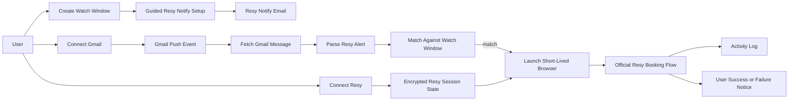

# Reservation Assistant V1: Notify-Triggered Auto-Claim

> A real demo for one user: official Resy Notify provides the signal, Gmail push provides low-latency ingestion, and a saved Resy browser session provides fast on-demand execution with explicit reconnect and anti-abuse controls.

### Key References

|           |                                                                      |                                |
| --------- | -------------------------------------------------------------------- | ------------------------------ |
| **Item**  | [task.0166](../../work/items/task.0166.reservation-assistant-mvp.md) | Existing reservation work item |
| **Guide** | [Reservation Assistant Guide](../guides/reservation-assistant.md)    | Local dev and compliance notes |
| **Spec**  | [Security & Authentication](./security-auth.md)                      | Secret handling and auth rules |
| **Spec**  | [Architecture](./architecture.md)                                    | Hexagonal layering and wiring  |

## Design

### End-User Happy Path

1. The user signs into the app.
2. The user connects Gmail with Google OAuth.
3. The user connects Resy by completing a user-driven login in a controlled browser flow on the official Resy site.
4. The app stores encrypted reusable browser session state.
5. The controlled browser flow may require MFA or later re-auth; the product must treat that as normal.
6. The user creates a watch in the app using a flexible intent window:
   restaurant, party size, date range, time range, ideal time, hard constraints, soft constraints, and `auto_claim=true`.
7. The app opens the official Resy page with the correct venue/date/party-size context.
8. The user performs the shortest possible manual Notify confirmation required by Resy.
9. Later, Resy sends an official Notify email.
10. Gmail push triggers the backend immediately.
11. The backend fetches the new message, parses the opening, de-dupes the event, and matches it to an active watch.
12. If the opening satisfies the watch, the app launches a fresh browser with saved Resy auth state and attempts the official booking flow.
13. The result is written to the activity log and sent to the user immediately as a success or failure notification.

### Setup Flow

The product surface for v1 is one authenticated dashboard with three sections:

1. `Connections` — connect Gmail, connect Resy, and reconnect either one
2. `Create Watch` plus the watch list — create and manage flexible intent windows
3. `Activity Log` — success, failure, dedupe, and reconnect-required events

### Runtime Flow

The runtime path for v1 is intentionally narrow:

1. Gmail push event arrives.
2. Gmail message fetch retrieves the new Resy Notify email.
3. Parser extracts venue, party size, date, time, and booking link details available in the email.
4. Dedupe logic collapses repeated Gmail push events and repeated email deliveries into one logical alert for the same user.
5. Matcher compares the alert to active app-owned watches.
6. Concurrency guard ensures only one active claim attempt exists per watch.
7. Executor starts a short-lived Playwright run using encrypted saved auth state.
8. Executor attempts the official Resy flow.
9. Result is persisted and surfaced immediately on the reservations page, with browser notifications when the page is open and permissions are granted.

## Goal

Ship a truthful, functioning, single-user demo that can automatically react to official Resy Notify alerts within seconds, using the user's saved Resy session and a watch window defined in our app rather than a fake provider abstraction or a nonexistent public Resy consumer API.

## Non-Goals

- Resy OAuth
- Resy API key integration
- Scraping inventory pages on a timer
- Reverse-engineered private API dependencies
- Multi-user marketplace behavior
- Provider-generic architecture in v1
- Long-running background browsers
- Placeholder Temporal workflows or internal APIs that are not fully wired

## Invariants

| Rule                         | Constraint                                                                                                                     |
| ---------------------------- | ------------------------------------------------------------------------------------------------------------------------------ |
| WATCH_INTENT_CANONICAL       | The app-owned watch definition is the source of truth for acceptable reservation windows.                                      |
| OFFICIAL_ALERTS_ONLY         | V1 reacts only to official provider alerts delivered through Gmail, not scraped availability polling.                          |
| GMAIL_PUSH_IS_TRIGGER        | Gmail push events are the low-latency ingestion trigger; email polling is fallback-only.                                       |
| GMAIL_WATCH_RENEWAL_REQUIRED | Gmail watch registrations must be renewed before expiry or all affected watches must move into a reconnect-required state.     |
| WINDOW_BASED_MATCHING        | Matching is done against a user-defined date/time window plus hard and soft constraints, not a single exact slot.              |
| NO_STANDING_BROWSER          | The system must never keep a logged-in browser open indefinitely waiting for alerts.                                           |
| SHORT_LIVED_EXECUTOR         | Each booking attempt runs in a fresh, bounded browser execution and exits immediately after success or failure.                |
| ENCRYPTED_SESSION_STATE      | Stored Resy session state must be encrypted at rest and never exposed in client storage.                                       |
| REAUTH_IS_EXPLICIT           | Session expiry must surface a clean `Reconnect Resy` path instead of silent retries with broken auth.                          |
| USER_AUTHORIZES_AUTO_CLAIM   | Auto-claim must be explicitly enabled on a watch; no implicit booking behavior is allowed.                                     |
| EMAIL_EVENT_DEDUP            | Repeated Gmail push events and repeated copies of the same Resy email must collapse to one logical alert for the same user.    |
| CLAIM_ATTEMPT_IDEMPOTENT     | Retrying the same logical alert must not create duplicate independent claim attempts.                                          |
| ONE_ACTIVE_CLAIM_PER_WATCH   | At most one claim attempt may run at a time for a given watch.                                                                 |
| RESY_ONLY_V1                 | V1 is Resy-specific. No generic provider abstraction is required until a second real provider exists.                          |
| AUDIT_LOG_APPEND_ONLY        | Every important state transition must append a user-visible activity event.                                                    |
| IMMEDIATE_USER_NOTIFICATION  | Claim success, claim failure, reconnect-required, and Gmail attention states must surface immediately in the authenticated UI. |
| NO_MULTI_ACCOUNT_ABUSE       | V1 is for one real user account only: no account farming, no proxy rotation, no evasion, and no parallel claim spam.           |
| NO_DEAD_ORCHESTRATION        | V1 must not ship workflow paths, internal endpoints, or background jobs that are not end-to-end runnable.                      |

## Schema

### Canonical Watch

The app owns the canonical watch object.

| Field              | Type      | Constraints   | Description                                                                   |
| ------------------ | --------- | ------------- | ----------------------------------------------------------------------------- |
| `restaurant`       | string    | required      | Human-readable venue name                                                     |
| `party_size`       | integer   | required, > 0 | Requested party size                                                          |
| `date_start`       | timestamp | required      | Earliest acceptable reservation date                                          |
| `date_end`         | timestamp | required      | Latest acceptable reservation date                                            |
| `time_start`       | string    | required      | Earliest acceptable local time                                                |
| `time_end`         | string    | required      | Latest acceptable local time                                                  |
| `ideal_time`       | string    | optional      | Preferred local time used for ranking                                         |
| `hard_constraints` | json      | optional      | Constraints that must be satisfied                                            |
| `soft_constraints` | json      | optional      | Preferences used for ranking, not filtering                                   |
| `auto_claim`       | boolean   | required      | Whether automatic booking is allowed                                          |
| `status`           | enum      | required      | `active`, `paused`, `fulfilled`, `cancelled`, `expired`, `reconnect_required` |

### Gmail Connection

| Field                  | Type      | Constraints | Description                                       |
| ---------------------- | --------- | ----------- | ------------------------------------------------- |
| `google_account_email` | string    | required    | Connected Gmail account                           |
| `oauth_subject`        | string    | required    | Stable Google identity                            |
| `watch_status`         | enum      | required    | `active`, `expired`, `error`                      |
| `history_cursor`       | string    | required    | Gmail incremental fetch cursor                    |
| `watch_expiry_at`      | timestamp | required    | Gmail watch renewal deadline                      |
| `renewal_status`       | enum      | required    | `healthy`, `due`, `expired`, `reconnect_required` |

### Resy Session

| Field                      | Type      | Constraints | Description                                  |
| -------------------------- | --------- | ----------- | -------------------------------------------- |
| `provider`                 | enum      | required    | `resy`                                       |
| `session_state_ciphertext` | text      | required    | Encrypted Playwright storage state           |
| `session_status`           | enum      | required    | `connected`, `expired`, `reconnect_required` |
| `last_verified_at`         | timestamp | optional    | Last successful validation of saved session  |
| `expires_hint_at`          | timestamp | optional    | Best-effort expiry hint from validation      |

### Activity Event

| Field        | Type      | Constraints | Description                                                                                                                                                                                                                |
| ------------ | --------- | ----------- | -------------------------------------------------------------------------------------------------------------------------------------------------------------------------------------------------------------------------- |
| `event_type` | enum      | required    | `gmail_connected`, `gmail_watch_renewed`, `resy_connected`, `watch_created`, `alert_received`, `alert_deduped`, `alert_matched`, `alert_ignored`, `claim_started`, `claim_succeeded`, `claim_failed`, `reconnect_required` |
| `source`     | enum      | required    | `system`, `gmail`, `resy`, `executor`                                                                                                                                                                                      |
| `dedupe_key` | string    | optional    | Stable key for collapsing duplicate email events or claim retries                                                                                                                                                          |
| `payload`    | json      | optional    | Structured details for debugging and UX                                                                                                                                                                                    |
| `created_at` | timestamp | required    | Event time                                                                                                                                                                                                                 |

## Product Rules

### Watch Ownership

- The user configures a flexible window in our app.
- The provider alert is only an upstream signal.
- The matcher decides whether a slot is acceptable.

### Provider Setup

- V1 may require one short manual action on the official Resy UI to enable Notify.
- The app must deep-link the user into the closest possible venue/date/party-size setup context.
- The user must not be required to micromanage exact slots inside our app.

### Auth Handling

- Gmail remains the persistent trigger.
- Gmail watch renewal is an explicit lifecycle responsibility, not a background assumption.
- Resy auth state is persisted securely.
- Browsers are launched only on demand.
- Expired auth immediately moves affected watches into a reconnect-required state.

### Execution Policy

- Booking attempts must use only the official Resy web flow.
- A booking attempt is bounded to one alert-driven execution.
- Duplicate email deliveries or duplicate push events must not create duplicate claim attempts.
- Only one claim attempt may be active per watch at a time.
- Failed auth, missing session state, or expired session must stop execution early and log a reconnect-required event.
- Success, failure, and reconnect-required states must surface immediately in the reservations UI.

## Acceptance Checks

### Product Acceptance

1. A user can connect Gmail and the app records an active Gmail watch.
2. Gmail watch renewal is observable and reconnect/renewal failure is visible in the app.
3. A user can connect Resy through a user-driven login flow and the app stores encrypted reusable auth state.
4. The user can re-auth Resy after session expiry or MFA interruption.
5. A user can create a window-based watch with `auto_claim=true`.
6. The user can complete a short official Resy Notify setup flow from the watch screen.
7. A Resy Notify email can be ingested and matched to the watch within seconds.
8. Duplicate Gmail events do not create duplicate logical alerts.
9. A matching alert launches a short-lived browser run using saved auth state.
10. Only one active claim attempt runs for a watch at a time.
11. The app records success or failure in the activity log.
12. The user receives immediate success/failure/reconnect-required notification.

### Engineering Acceptance

1. `pnpm check` passes.
2. Reservation schema changes have checked-in migrations.
3. Reservation routes have contract tests for connection setup, watch CRUD, and activity log responses.
4. Alert parsing and watch matching have unit tests.
5. Browser execution has at least one deterministic integration path in CI or a documented stack test path.

### File Pointers

| File                                                                   | Purpose                                                     |
| ---------------------------------------------------------------------- | ----------------------------------------------------------- |
| `docs/guides/reservation-assistant.md`                                 | Developer and compliance companion guide                    |
| `apps/web/src/contracts/reservations.watch.v1.contract.ts`             | Canonical watch API shapes                                  |
| `apps/web/src/contracts/reservations.connections.v1.contract.ts`       | Gmail and Resy connection contracts                         |
| `apps/web/src/core/reservations/`                                      | Window matching rules and domain types                      |
| `apps/web/src/features/reservations/services/watch-manager.ts`         | Watch CRUD and status transitions                           |
| `apps/web/src/features/reservations/services/gmail-alert-ingestion.ts` | Gmail-triggered alert fetch and parse orchestration         |
| `apps/web/src/features/reservations/services/connection-manager.ts`    | Gmail and Resy connection lifecycle orchestration           |
| `apps/web/src/adapters/server/gmail/`                                  | Gmail OAuth, watch registration, and message fetch adapters |
| `apps/web/src/adapters/server/reservations/`                           | Resy session handling and Playwright execution adapters     |
| `apps/web/src/app/(app)/reservations/`                                 | Reservation dashboard UI                                    |
| `apps/web/src/app/api/v1/reservations/`                                | Thin delivery routes over the v1 contracts                  |
| `apps/web/src/adapters/server/db/migrations/`                          | Checked-in schema migrations for v1 tables                  |

## Open Questions

- [ ] Whether Gmail push should be backed by Pub/Sub push directly into the app or via a small relay service in preview/production.
- [ ] Exact structure of Resy Notify emails we will parse first: single restaurant confirmation, slot-opening alert, or both.

## Related

- [Architecture](./architecture.md)
- [Security & Authentication](./security-auth.md)
- [Reservation Assistant Guide](../guides/reservation-assistant.md)
